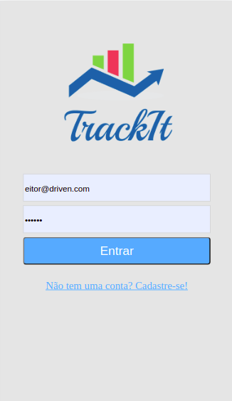
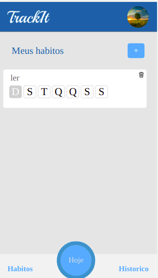
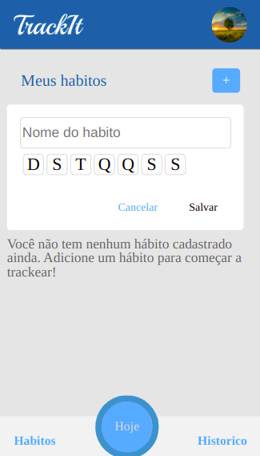
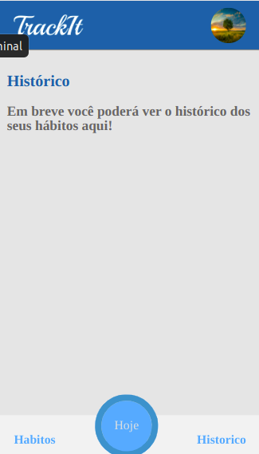
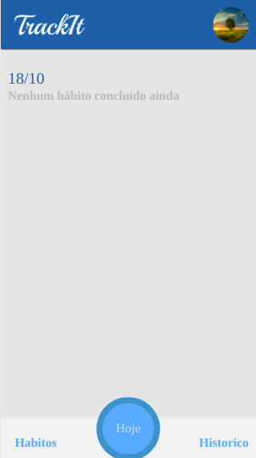

<h1>Registration of daily habits</h1>

<h3>Application made in a responsive way, using react, javascript and styled components</h3>

<h6>Register, log in and put your habits separated by days of the week</h6>

  

